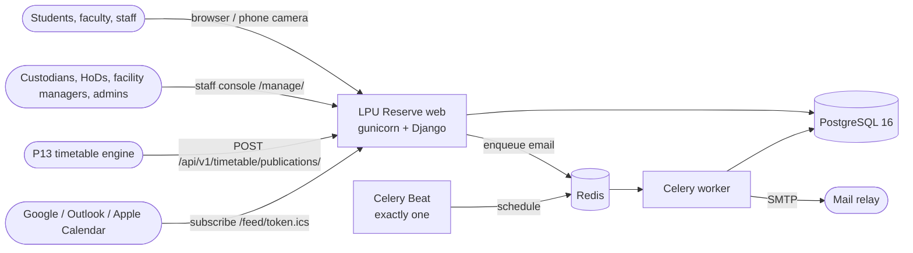
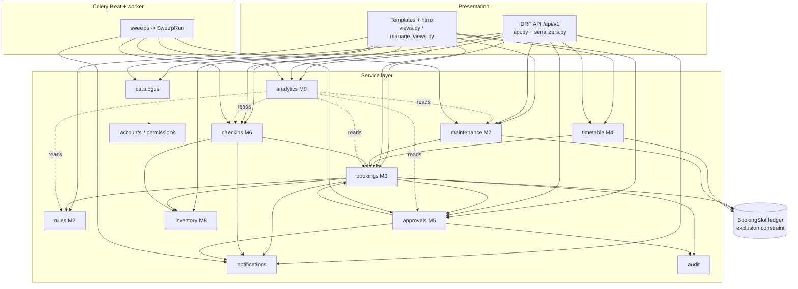

# Architecture

LPU Reserve is a Django 5.2 modular monolith on PostgreSQL 16, with Celery (Redis broker) for
background work. It follows the EduRev Common Engineering Standard (CES) Track P, Path P1:
server-rendered Django templates with htmx, and a Django REST Framework API alongside.

Decisions behind this shape are recorded in [`docs/adr/`](adr/README.md).

## Context



| External party | Integration today | Notes |
|---|---|---|
| P13 timetable | `POST /api/v1/timetable/publications/` (JSON rows) or CSV upload in the console | All-or-nothing publish; see [ADR 0003](adr/0003-exclusion-constraints-and-unified-ledger.md) |
| Personal calendars | `.ics` per booking and a private subscription feed per person | One-way export; no Google/Outlook API push |
| Email | Django `send_mail` from a Celery task | SMTP host settings are not yet environment-driven; see [known issues](known-issues.md) |
| University SSO / ERP | Not built | Seam described in [known issues](known-issues.md#integrations) |

## Module map

One Django app per P20 functional module (CES §1.2). Each app owns its models and exposes a
service interface in `services.py`; other apps call those functions, not each other's tables.

| App | P20 module | Owns | Service interface (main entry points) |
|---|---|---|---|
| `apps/core` | Platform | `Institution`, `SweepRun`, tenancy middleware, health probes, shell context, staff-console home and ops page, design-system template tags, `seed_demo`, `run_sweeps` | `sweeps.run_sweep`, `scope.managed_resources`, `health.run_checks` |
| `apps/accounts` | Roles (§6) | `User`, `Department`, role groups, MFA | `permissions.has_cap`, `can_manage_resource`, `is_campus_wide`, `managed_resource_ids`, `mfa.*` |
| `apps/catalogue` | M1 Resource catalogue | `ResourceType`, `Resource`, `ResourceAttribute`, `ResourceImage`, `Custodian`, `Building`, `Feature`, `SavedResource` | `search.*` (full-text + trigram), `manage_forms.parse_import/commit_import` |
| `apps/rules` | M2 Availability and rules | `BookingPolicy`, `AvailabilityRule`, `Blackout`, `Quota`, `RestrictionTier` | `policy_for`, `policies_for`, `weekly_hours_for`, `opening_intervals`, `blackouts_for`, `validate_request`, `check_quota`, `quota_usage` |
| `apps/bookings` | M3 Booking engine | `Booking`, `BookingSlot`, `BookingSeries`, `BookingAttempt` | `create_booking`, `cancel_booking`, `set_status`, `claim_block`, `release_blocks`, `displace_bookings`, `preview_series`, `create_series`, `suggest_alternatives`, `availability.schedule/board` |
| `apps/timetable` | M4 Timetable integration | `AcademicTerm`, `TimetablePublication`, `TimetableEntry` | `parse_rows`, `stage`, `publish`, `import_and_publish`, `export_csv`, `displacement_preview` |
| `apps/approvals` | M5 Approval workflow | `ApprovalWorkflow`, `ApprovalStep`, `Approval` | `resolve_workflow`, `start_chain`, `decide`, `queue_for`, `expire_stale`, `workflow_forms.explain` |
| `apps/checkins` | M6 Check-in and auto-release | `CheckIn`, `NoShow`, `Restriction` | `check_in`, `check_in_at_resource`, `check_out`, `sweep_no_shows`, `sweep_completed`, `apply_ladder`, `forgive`, `lift_restriction` |
| `apps/maintenance` | M7 Maintenance and downtime | `MaintenanceWindow`, `BreakdownReport` | `schedule`, `cancel`, `complete`, `report_breakdown`, `resolve`, `sweep_windows`, `impact` |
| `apps/inventory` | M8 Consumables and accessories | `InventoryItem`, `Issuance`, `StockMovement` | `reserve`, `issue_for_booking`, `return_for_booking`, `cancel_reservations`, `restock`, `low_stock` |
| `apps/analytics` | M9 Analytics and reporting | `UtilisationSnapshot` | `build_snapshots`, `overview`, `utilisation_by`, `idle_capacity_ranking`, `heatmap`, `no_show_rates`, `demand_vs_supply`, `approval_turnaround`, `maintenance_downtime`, `department_quota_consumption` |
| `apps/notifications` | §11 Notifications | `Notification` | `notify`, `notify_many`, `unread_count` |
| `apps/audit` | CES §1.4 audit | `AuditLog` (append-only) | `record` |

Cross-module calls go through these functions, usually as a local import inside the calling
function to keep import cycles out (for example `bookings.create_booking` calls
`rules.validate_request`, `approvals.resolve_workflow`, `inventory.reserve` and `audit.record`).
Read-only joins across app models do occur in querysets (for example analytics reading
bookings); writes always go through the owning app's service.



## Request flow

A view or API endpoint parses input, calls one service, and renders. Business rules are in
services and are unit-tested without HTTP (CES §1.2).

```mermaid
sequenceDiagram
    participant B as Browser (htmx form)
    participant V as bookings.views.create
    participant S as bookings.services.create_booking
    participant R as rules.validate_request / check_quota
    participant A as approvals.resolve_workflow / start_chain
    participant DB as PostgreSQL
    B->>V: POST /r/<slug>/book/
    V->>S: create_booking(requester, resource, start, end, ...)
    S->>R: role, restriction, slot grid, duration, lead time, window, hours, blackouts, capacity
    S->>DB: friendly pre-check: BookingSlot overlap (message only)
    S->>DB: BEGIN; SELECT ... FOR UPDATE user (and department) row
    S->>R: check_quota (exact under the row lock)
    S->>A: resolve_workflow -> pending or approved
    S->>DB: pg_advisory_xact_lock(20020, resource_id)
    S->>DB: SAVEPOINT; INSERT Booking + BookingSlot
    DB-->>S: ok, or 23P01 exclusion_violation -> SlotUnavailable
    S->>A: start_chain (Approval rows, notify approvers)
    S->>DB: inventory.reserve, audit.record, notification rows; COMMIT
    S-->>V: Booking or DomainError (sentence + code)
    V-->>B: HX-Redirect to pass, or the booking panel with the reason and alternatives
```

Domain errors (`apps/core/errors.py`) carry a human sentence and a code (`conflict`,
`timetable`, `maintenance`, `blackout`, `closed`, `quota`, `restricted`, `policy`,
`forbidden`). Views show the sentence; the API returns them as an `{"error": {code, message,
detail}}` envelope with 409 (`SlotUnavailable`, `InvalidTransition`), 422 (`BookingRejected`)
or 403 (`NotPermitted`) through `apps/core/api.exception_handler`. Every attempt, successful or not, is
recorded in `BookingAttempt` for demand-versus-supply analytics.

## The BookingSlot ledger

`BookingSlot` is the single ledger of claimed time on a resource. Bookings, published
timetable class occurrences and maintenance windows each write one row, and an unconditional
exclusion constraint (`slot_no_overlap`) forbids any two rows for the same resource from
overlapping. `Booking` has its own partial constraint (`booking_no_overlap`) over holding
statuses. The argument and the 500-attempt proof are in
[booking-concurrency.md](booking-concurrency.md); the decision is
[ADR 0003](adr/0003-exclusion-constraints-and-unified-ledger.md).

| Writer | `kind` | Source columns | Freed by |
|---|---|---|---|
| `bookings.create_booking` | `booking` | `booking_id` | `set_status` leaving a holding status; `shrink_booking` on early check-out |
| `timetable.publish` | `class` | `source_type='timetable_entry'`, `source_id` | the next publication for the term (same transaction) |
| `maintenance.schedule` | `maintenance` | `source_type='maintenance_window'`, `source_id` | `maintenance.cancel`; `complete` shrinks it |

Because everything that blocks a room lives in one table, availability is one indexed range
query (`availability._load`), and "a room teaching at 10 a.m. is simply not offered" holds in
the database, not only in the UI.

## Background jobs

Celery Beat drives periodic sweeps; a worker runs them. Each sweep is wrapped in
`core.sweeps.run_sweep`, which writes a `SweepRun` row (start, finish, rows affected, error)
shown on the staff ops page (`/manage/ops/`). Sweeps use `SELECT ... FOR UPDATE SKIP LOCKED`
where they mutate bookings, so overlapping runs are safe. See
[ADR 0006](adr/0006-celery-beat-sweeps-with-sweeprun.md).

| Beat entry | Task | Interval | What it does |
|---|---|---|---|
| `auto-release-no-shows` | `checkins.sweep_no_shows` | 60 s | Releases confirmed bookings not checked into within the grace period, records `NoShow`, applies the restriction ladder |
| `complete-finished-bookings` | `checkins.sweep_completed` | 300 s | Auto checks out ended sessions; completes ended bookings that need no check-in |
| `expire-stale-approvals` | `approvals.sweep_expired` | 300 s | Expires pending requests whose start time passed |
| `send-reminders` | `notifications.send_reminders` | 300 s | Reminder 30 minutes before a confirmed booking |
| `check-in-open-nudges` | `notifications.send_checkin_nudges` | 60 s | "Check in now, N min left" once a booking starts (in-app only) |
| `maintenance-transitions` | `maintenance.sweep_windows` | 300 s | Scheduled to in progress to completed; reopens resources |
| `lift-expired-restrictions` | `checkins.sweep_restrictions` | 3600 s | Counts pauses that lapsed in the last hour (restrictions end by time; nothing is mutated) |
| `nightly-utilisation-snapshot` | `analytics.build_snapshots` | 01:15 daily | Rolls up yesterday into `UtilisationSnapshot` (idempotent upsert) |

Notification email is a separate task (`notifications.send_email`), enqueued with
`transaction.on_commit` so mail is only sent for committed changes.

Without a broker (local development, laptop demos) `python manage.py run_sweeps --loop` runs
the same schedule in-process. Production uses exactly one `celery beat` process.

## Tenancy

CES §1.2 requires every domain record to carry an institution identifier. Root and
top-level domain models inherit `core.TenantModel`, which adds `institution` (FK to
`Institution`, `on_delete=PROTECT`, defaulting to the `DEFAULT_INSTITUTION_CODE` tenant).
Child rows (for example `BookingSlot`, `Approval`, `CheckIn`, `Issuance`, `TimetableEntry`,
`UtilisationSnapshot`, `Notification`) reach their institution through their parent's FK.
Natural-key uniqueness is per institution (`uniq_resource_code` is `(institution, code)`).

Every query in views and API viewsets filters on `request.user.institution_id`;
`InstitutionMiddleware` sets `request.institution_id` for anonymous requests. Today the
deployment serves one tenant (LPU). The gaps that a second tenant would expose are listed in
[known issues](known-issues.md#tenancy). See [ADR 0011](adr/0011-tenancy-via-institution-fk.md).

## Security architecture

| Concern | Mechanism | Where |
|---|---|---|
| Authentication | Django session auth (Path P1); DRF uses `SessionAuthentication` | `config/settings.py` |
| Second factor | TOTP for `admin`, `facility_manager` and superusers (`MFA_REQUIRED_ROLES`); enrolment on first password sign-in; secret Fernet-encrypted with a key derived from `DJANGO_SECRET_KEY`; each code is single-use (last accepted time step stored). `MFASessionMiddleware` ends any session of a user who needs MFA unless it carries the stamp `mfa_view` writes, so a promotion mid-session or any sign-in path that skipped MFA forces a fresh sign-in (API: 401 `mfa_required`). `/django-admin/login/` is the product sign-in view | `apps/accounts/mfa.py`, `middleware.py`, `views.mfa_view`, `views.admin_login` |
| Brute force | Per-account lockout after 5 failures for 15 minutes; per-IP rate limits on sign-in (20/min), MFA (20/min) and demo sign-in (30/min); DRF throttles (user 600/min, anon 60/min) | `apps/accounts/views.py`, `REST_FRAMEWORK` |
| Authorisation | Role groups with capability permissions (RBAC) plus object scope, enforced twice: capability check and a scoped queryset. UI hiding is cosmetic | `apps/accounts/permissions.py`, `apps/core/scope.py`, `HasCap` in `apps/core/api.py`; see [roles.md](roles.md) |
| Demo personas | One-click sign-in only when `DEMO_MODE=1` (default off), never shown otherwise | `views.demo_login` |
| Browser hardening | CSP `script-src 'self'` (no inline script, htmx `allowEval` off), `frame-ancestors 'none'`, `X-Frame-Options: DENY`, `nosniff`, `Referrer-Policy: same-origin`, `Permissions-Policy: camera=(self)`, COOP | `SecurityHeadersMiddleware`; [ADR 0010](adr/0010-strict-csp-no-inline-js.md) |
| Transport | With `DEBUG=0`: secure cookies, HSTS 30 days, `SECURE_PROXY_SSL_HEADER`, optional `SECURE_SSL_REDIRECT` | `config/settings.py` |
| Uploads | Resource photos: size cap, declared type, magic bytes, Pillow verify, pixel cap, re-encoded to metadata-free WebP. CSV imports: size and row caps, parsed then discarded | `apps/catalogue/manage_forms.py` |
| Audit | Append-only `AuditLog` enforced by a PostgreSQL trigger; every privileged action records actor, action, target, before/after, IP | `apps/audit/`; [ADR 0012](adr/0012-append-only-audit-trigger.md) |
| Privacy (DPDP) | Self-service JSON export of everything held about a person (`/me/export/`) | `accounts.views.export_my_data` |
| Secrets | Environment only; gitleaks and pip-audit in CI | `.github/workflows/ci.yml`; [environment.md](environment.md) |
| Probes | `/health/` (no DB) and `/ready/` (DB `SELECT 1`, Redis `PING`) answered by middleware before host checks | `apps/core/health.py` |
| Container | Multi-stage image, non-root user (uid 10001), static files baked at build | `Dockerfile` |

## Deployment shape

One image runs every role: `web` (gunicorn, `RUN_MIGRATIONS=1` on one instance), `worker`
(`celery -A config worker`), and exactly one `beat` (`celery -A config beat`). PostgreSQL 16
and Redis 7 are external services (compose provides both for local use). See
[runbook.md](runbook.md) and [environment.md](environment.md).

## Further reading

- [database.md](database.md): schema, constraints, ERD
- [booking-concurrency.md](booking-concurrency.md): the conflict-prevention argument and proof
- [design-system.md](design-system.md): UI contract
- [openapi.yaml](openapi.yaml): API specification (live at `/api/v1/docs/`)
