# Database schema

PostgreSQL 16 with the `btree_gist` and `pg_trgm` extensions (migration `core.0002`). All
tables are created by committed Django migrations, which apply to an empty database and reverse
cleanly (`migrate <app> zero` for every app, then forward again, was verified on
2026-10-01). Table names follow Django's `<app>_<model>` convention (for example
`bookings_booking`).

## Conventions

| Convention | Detail |
|---|---|
| Primary keys | `bigint` identity (`BigAutoField`) |
| Time | `timestamptz` everywhere (`USE_TZ=True`); local time is `Asia/Kolkata` |
| Ranges | Bookings, ledger slots, blackouts, maintenance windows and booking attempts store their time as `tstzrange` (`DateTimeRangeField`), half-open `[start, end)`, so back-to-back periods do not overlap |
| Money and hours | `numeric` (`DecimalField`): `Resource.acquisition_cost` (₹), `Quota.max_hours` |
| Tenancy | Models inheriting `core.TenantModel` carry `institution_id` (FK, `PROTECT`); child rows inherit it through their parent ([ADR 0011](adr/0011-tenancy-via-institution-fk.md)) |
| Positive integers | `PositiveIntegerField` / `PositiveSmallIntegerField` columns get a `CHECK (col >= 0)` from Django |
| Choices | Stored as short strings (`status`, `kind`, `role`); arrays of roles use `varchar[]` (`ArrayField`) |

## Spec entities and where they live

P20 §8 "Data model" lists eighteen entities. All exist; some are split or renamed.

| P20 entity | Implementation | Notes |
|---|---|---|
| ResourceType | `catalogue.ResourceType` | `allowed_roles` restricts who may book the type |
| Resource | `catalogue.Resource` | Capacity, building/floor/room, owning department, features, status, photo, acquisition cost, full-text vector |
| ResourceAttribute | `catalogue.ResourceAttribute` | Free key/value pairs per resource |
| Custodian | `catalogue.Custodian` | User-resource link with `is_primary` |
| AvailabilityRule | `rules.AvailabilityRule` (opening hours) and `rules.BookingPolicy` (slot size, durations, lead time, booking window, check-in timing, capacity enforcement) | Scoped campus / type / resource |
| Blackout | `rules.Blackout` | Scoped campus / block / type / resource, with exempt roles |
| Quota | `rules.Quota` | Role or department target, optional resource type, day/week/month |
| Booking | `bookings.Booking` | Status machine in `bookings.models.TRANSITIONS` |
| BookingSlot | `bookings.BookingSlot` | The unified ledger for bookings, classes and maintenance |
| RecurrenceRule | `bookings.BookingSeries` | Daily or weekly pattern, expanded into individual bookings; `skipped` records dates not booked and why |
| ApprovalWorkflow | `approvals.ApprovalWorkflow` + `approvals.ApprovalStep` | Steps hold the approver role and SLA |
| Approval | `approvals.Approval` | One row per step per booking; also the decision trail |
| CheckIn | `checkins.CheckIn` | Method, who, check-out, minutes handed back |
| NoShow | `checkins.NoShow` + `checkins.Restriction` + `rules.RestrictionTier` | Ladder tiers are data; restrictions are the resulting pauses |
| MaintenanceWindow | `maintenance.MaintenanceWindow` + `maintenance.BreakdownReport` | Windows write to the ledger; reports may create a window |
| Consumable | `inventory.InventoryItem` (`kind` = `consumable` or `accessory`) + `inventory.StockMovement` | Accessories return to stock; consumables are used up |
| Issuance | `inventory.Issuance` | Reserved with a booking, issued at check-in, returned at check-out |
| UtilisationSnapshot | `analytics.UtilisationSnapshot` | One row per resource per day, built nightly |

Additional tables: `core.Institution`, `core.SweepRun`, `accounts.User`,
`accounts.Department`, `catalogue.Building`, `catalogue.Feature`, `catalogue.ResourceImage`,
`catalogue.SavedResource`, `bookings.BookingAttempt`, `timetable.AcademicTerm`,
`timetable.TimetablePublication`, `timetable.TimetableEntry`, `notifications.Notification`,
`audit.AuditLog`. Django's own tables (`auth_group`, `auth_permission`, `django_session`,
`django_migrations`, ...) are standard.

## Entity-relationship diagram

Every model that inherits `TenantModel` also has `institution_id` referencing `Institution`;
only the main ones are drawn to keep the diagram readable. `BookingSlot.source_type` /
`source_id` point at a timetable entry or maintenance window without a database foreign key
(dotted lines).

```mermaid
erDiagram
    Institution ||--o{ User : "tenant of"
    Institution ||--o{ Resource : "tenant of"
    Institution ||--o{ Booking : "tenant of"
    Institution ||--o{ AuditLog : "tenant of"

    Department ||--o{ User : "members"
    Department |o--o{ Resource : "owns"
    Building |o--o{ Resource : "houses"
    ResourceType ||--o{ Resource : "classifies"
    Resource }o--o{ Feature : "has"
    Resource ||--o{ ResourceAttribute : "described by"
    Resource ||--o{ ResourceImage : "gallery"
    Resource ||--o{ Custodian : "looked after by"
    User ||--o{ Custodian : "custodian of"
    User ||--o{ SavedResource : "saves"
    Resource ||--o{ SavedResource : "saved as"

    ResourceType |o--o{ BookingPolicy : "scope"
    Resource |o--o{ BookingPolicy : "scope"
    ResourceType |o--o{ AvailabilityRule : "scope"
    Resource |o--o{ AvailabilityRule : "scope"
    ResourceType |o--o{ Blackout : "scope"
    Resource |o--o{ Blackout : "scope"
    Building |o--o{ Blackout : "block scope"
    Department |o--o{ Quota : "shared pool"
    ResourceType |o--o{ Quota : "limited type"

    Resource ||--o{ Booking : "booked"
    User ||--o{ Booking : "booked_for / requester"
    BookingSeries |o--o{ Booking : "occurrence of"
    Resource ||--o{ BookingSeries : "recurs on"
    User ||--o{ BookingSeries : "requests"
    Resource ||--o{ BookingSlot : "claimed time"
    Booking |o--o| BookingSlot : "claims"
    TimetableEntry ||..o{ BookingSlot : "class occurrences"
    MaintenanceWindow ||..o| BookingSlot : "maintenance claim"
    Resource ||--o{ BookingAttempt : "demand"
    User |o--o{ BookingAttempt : "attempted by"

    ResourceType |o--o{ ApprovalWorkflow : "matches type"
    Resource |o--o{ ApprovalWorkflow : "matches resource"
    ApprovalWorkflow ||--|{ ApprovalStep : "ordered steps"
    User |o--o{ ApprovalStep : "named approver"
    Booking ||--o{ Approval : "chain"
    ApprovalWorkflow |o--o{ Approval : "from"
    User |o--o{ Approval : "decided_by"

    Booking ||--o| CheckIn : "checked in"
    User ||--o{ CheckIn : "checked_in_by"
    Booking ||--o| NoShow : "released as"
    User ||--o{ NoShow : "missed"
    Resource ||--o{ NoShow : "at"
    User ||--o{ Restriction : "paused"
    Institution ||--o{ RestrictionTier : "ladder"

    Resource ||--o{ MaintenanceWindow : "downtime"
    Resource ||--o{ BreakdownReport : "reported"
    User ||--o{ BreakdownReport : "reported_by / confirmed_by"
    MaintenanceWindow |o--o{ BreakdownReport : "repairs"

    Resource |o--o{ InventoryItem : "kit for"
    ResourceType |o--o{ InventoryItem : "kit for type"
    Booking ||--o{ Issuance : "requests"
    InventoryItem ||--o{ Issuance : "issued as"
    InventoryItem ||--o{ StockMovement : "ledger"
    Issuance |o--o{ StockMovement : "caused"

    Resource ||--o{ UtilisationSnapshot : "daily roll-up"

    AcademicTerm ||--o{ TimetablePublication : "versions"
    TimetablePublication ||--o{ TimetableEntry : "classes"
    Resource ||--o{ TimetableEntry : "room"

    User ||--o{ Notification : "inbox"
    User |o--o{ AuditLog : "actor"

    Institution {
        bigint id PK
        varchar code UK
        varchar name
        varchar timezone
    }
    SweepRun {
        bigint id PK
        varchar task
        timestamptz started_at
        timestamptz finished_at
        int affected
        bool ok
        jsonb detail
    }
    Department {
        bigint id PK
        bigint institution_id FK
        varchar code
        varchar name
        varchar school
    }
    User {
        bigint id PK
        bigint institution_id FK
        varchar username UK
        varchar role
        varchar vid
        bigint department_id FK
        uuid calendar_token UK
        text mfa_secret "Fernet-encrypted"
        bool mfa_enabled
        bigint mfa_last_step "last accepted TOTP step"
        smallint failed_logins
        timestamptz locked_until
    }
    Building {
        bigint id PK
        bigint institution_id FK
        varchar code
        varchar name
        varchar zone
    }
    ResourceType {
        bigint id PK
        bigint institution_id FK
        varchar code
        varchar name
        varchar category
        varchar_array allowed_roles
    }
    Feature {
        bigint id PK
        bigint institution_id FK
        varchar name
        varchar keywords
    }
    Resource {
        bigint id PK
        bigint institution_id FK
        bigint type_id FK
        varchar code
        varchar slug
        varchar name
        int capacity
        bigint building_id FK
        bigint department_id FK
        varchar status
        numeric acquisition_cost
        varchar image
        bool is_bookable
        tsvector search_vector
    }
    ResourceAttribute {
        bigint id PK
        bigint resource_id FK
        varchar key
        varchar value
    }
    ResourceImage {
        bigint id PK
        bigint resource_id FK
        varchar image
        varchar caption
    }
    Custodian {
        bigint id PK
        bigint resource_id FK
        bigint user_id FK
        bool is_primary
    }
    SavedResource {
        bigint id PK
        bigint user_id FK
        bigint resource_id FK
    }
    BookingPolicy {
        bigint id PK
        bigint institution_id FK
        varchar scope
        bigint resource_type_id FK
        bigint resource_id FK
        smallint slot_minutes
        smallint min_duration_minutes
        smallint max_duration_minutes
        int lead_time_minutes
        smallint max_advance_days
        bool requires_checkin
        smallint checkin_opens_minutes
        smallint checkin_grace_minutes
        bool enforce_capacity
    }
    AvailabilityRule {
        bigint id PK
        bigint institution_id FK
        varchar scope
        bigint resource_type_id FK
        bigint resource_id FK
        smallint weekday
        time opens
        time closes
    }
    Blackout {
        bigint id PK
        bigint institution_id FK
        varchar title
        varchar kind
        varchar scope
        bigint resource_type_id FK
        bigint resource_id FK
        bigint building_id FK
        tstzrange period
        varchar_array exempt_roles
    }
    Quota {
        bigint id PK
        bigint institution_id FK
        varchar role
        bigint department_id FK
        bigint resource_type_id FK
        varchar period
        numeric max_hours
        smallint max_bookings
        bool active
    }
    RestrictionTier {
        bigint id PK
        bigint institution_id FK
        smallint no_shows
        smallint window_days
        smallint restrict_days
        varchar label
    }
    Booking {
        bigint id PK
        bigint institution_id FK
        varchar reference UK
        bigint resource_id FK
        bigint requester_id FK
        bigint booked_for_id FK
        varchar group_label
        int attendees
        tstzrange period "EXCLUDE when holding"
        varchar status
        bigint series_id FK
        varchar qr_token UK
        bool requires_checkin
        smallint checkin_grace_minutes
        timestamptz checked_in_at
        timestamptz checked_out_at
    }
    BookingSlot {
        bigint id PK
        bigint resource_id FK
        tstzrange period "EXCLUDE always"
        varchar kind
        bigint booking_id FK
        varchar source_type
        bigint source_id
        varchar label
    }
    BookingSeries {
        bigint id PK
        bigint institution_id FK
        bigint resource_id FK
        bigint requester_id FK
        varchar frequency
        smallint interval
        smallint_array weekdays
        date start_date
        date until_date
        time start_time
        time end_time
        jsonb skipped
    }
    BookingAttempt {
        bigint id PK
        bigint resource_id FK
        bigint user_id FK
        tstzrange period
        varchar outcome
        timestamptz created_at
    }
    ApprovalWorkflow {
        bigint id PK
        bigint institution_id FK
        varchar name
        bigint resource_type_id FK
        bigint resource_id FK
        varchar_array requester_roles
        int min_attendees
        int min_duration_minutes
        bool auto_approve
        smallint priority
        bool active
    }
    ApprovalStep {
        bigint id PK
        bigint workflow_id FK
        smallint order
        varchar approver_role
        bigint approver_user_id FK
        smallint sla_hours
    }
    Approval {
        bigint id PK
        bigint booking_id FK
        bigint workflow_id FK
        smallint step_order
        varchar approver_role
        bigint approver_user_id FK
        varchar decision
        bigint decided_by_id FK
        varchar comment
        timestamptz due_at
        timestamptz decided_at
    }
    CheckIn {
        bigint id PK
        bigint booking_id FK "unique"
        timestamptz checked_in_at
        varchar method
        bigint checked_in_by_id FK
        timestamptz checked_out_at
        bool auto_checked_out
        int minutes_released
    }
    NoShow {
        bigint id PK
        bigint institution_id FK
        bigint booking_id FK "unique"
        bigint user_id FK
        bigint resource_id FK
        timestamptz detected_at
        int released_minutes
        bool forgiven
    }
    Restriction {
        bigint id PK
        bigint institution_id FK
        bigint user_id FK
        timestamptz starts_at
        timestamptz ends_at
        varchar tier_label
        bool automatic
        timestamptz lifted_at
    }
    MaintenanceWindow {
        bigint id PK
        bigint institution_id FK
        bigint resource_id FK
        varchar title
        varchar kind
        tstzrange period
        varchar status
        smallint displaced_bookings
    }
    BreakdownReport {
        bigint id PK
        bigint institution_id FK
        bigint resource_id FK
        bigint reported_by_id FK
        varchar summary
        varchar severity
        varchar status
        bigint window_id FK
        bigint confirmed_by_id FK
        timestamptz confirmed_at
    }
    InventoryItem {
        bigint id PK
        bigint institution_id FK
        varchar sku
        varchar name
        varchar kind
        bigint resource_id FK
        bigint resource_type_id FK
        int quantity_total
        int quantity_available
        int reorder_level
        int max_per_booking
    }
    Issuance {
        bigint id PK
        bigint booking_id FK
        bigint item_id FK
        int quantity
        varchar status
        timestamptz issued_at
        timestamptz returned_at
    }
    StockMovement {
        bigint id PK
        bigint item_id FK
        int delta
        varchar reason
        bigint issuance_id FK
        bigint actor_id FK
    }
    UtilisationSnapshot {
        bigint id PK
        bigint resource_id FK
        date date
        int open_minutes
        int class_minutes
        int maintenance_minutes
        int booked_minutes
        int used_minutes
        int released_minutes
        int bookings
        int no_shows
        int denied_attempts
        jsonb hourly_booked
    }
    AcademicTerm {
        bigint id PK
        bigint institution_id FK
        varchar code
        date starts
        date ends
    }
    TimetablePublication {
        bigint id PK
        bigint institution_id FK
        bigint term_id FK
        int version
        varchar source
        varchar status
        int occurrence_count
        int displaced_count
    }
    TimetableEntry {
        bigint id PK
        bigint publication_id FK
        bigint resource_id FK
        smallint weekday
        time start_time
        time end_time
        varchar course_code
        varchar section
    }
    Notification {
        bigint id PK
        bigint user_id FK
        varchar kind
        varchar title
        varchar url
        timestamptz read_at
        timestamptz emailed_at
    }
    AuditLog {
        bigint id PK
        bigint institution_id FK
        bigint actor_id FK
        varchar actor_label
        varchar action
        varchar target_type
        varchar target_id
        jsonb before
        jsonb after
        inet ip
        timestamptz created_at
    }
```

## Schema by module

### core

| Table | Purpose | Notable columns |
|---|---|---|
| `core_institution` | Tenant root | `code` (unique), `timezone` |
| `core_sweeprun` | One row per background sweep execution | `task`, `started_at`, `finished_at`, `affected`, `ok`, `detail` (error) |

### accounts

| Table | Purpose | Notable columns |
|---|---|---|
| `accounts_department` | Academic or administrative department | `(institution, code)` unique |
| `accounts_user` | Custom user (`AUTH_USER_MODEL`) | `role` (student, faculty, staff, custodian, dept_head, facility_manager, admin), `vid` (UMS registration / employee number), `department`, `section`, `calendar_token` (private feed credential), `mfa_secret` (encrypted), `mfa_last_step` (last accepted TOTP time step; codes are single-use), `failed_logins`, `locked_until` |

Roles map to Django groups `role:<role>` holding custom permissions declared on `User.Meta`;
`accounts.permissions.sync_role_groups` refreshes them after every `migrate`, and a
`post_save` signal keeps each user in their role's group. See [roles.md](roles.md).

### catalogue (M1)

| Table | Purpose | Notable columns |
|---|---|---|
| `catalogue_building` | Campus block | `code`, `zone`, map position |
| `catalogue_resourcetype` | Classroom, lab, seminar hall, equipment, vehicle... | `category`, `allowed_roles`, `icon`, `accent`, `sort_order` |
| `catalogue_feature` | Projector, AC, Wi-Fi... | `keywords` feed search |
| `catalogue_resource` | Anything bookable | see ERD; `search_vector` maintained by signals on save and feature change |
| `catalogue_resource_features` | M2M join | |
| `catalogue_resourceattribute` | Key/value specs | |
| `catalogue_resourceimage` | Gallery images | Not yet used by the UI (one photo per resource lives in `Resource.image`) |
| `catalogue_custodian` | Who looks after a resource | `is_primary` |
| `catalogue_savedresource` | A person's starred resources | |

### rules (M2)

| Table | Purpose |
|---|---|
| `rules_bookingpolicy` | Slot size, min/max duration, lead time, booking window, check-in opening and grace, capacity enforcement; scoped |
| `rules_availabilityrule` | Opening hours per weekday; scoped; the most specific scope with any rule wins |
| `rules_blackout` | Periods closed to booking; campus (optionally one block), type or resource; exempt roles |
| `rules_quota` | Hours and/or booking-count ceilings per day/week/month for a role or a department |
| `rules_restrictiontier` | No-show ladder: N unforgiven no-shows within W days pauses booking for D days (0 = warning) |

### bookings (M3)

| Table | Purpose |
|---|---|
| `bookings_booking` | A reservation. Holding statuses: `pending`, `approved`, `checked_in`. Terminal: `completed`, `cancelled`, `rejected`, `expired`, `no_show` |
| `bookings_bookingslot` | Ledger of claimed time: kinds `booking`, `class`, `maintenance` |
| `bookings_bookingseries` | A recurring pattern and the dates it skipped |
| `bookings_bookingattempt` | Every attempt with its outcome (booked, conflict, timetable, maintenance, blackout, closed, quota, restricted, policy, forbidden) |

### timetable (M4)

| Table | Purpose |
|---|---|
| `timetable_academicterm` | Term code and dates (UMS-style code, for example `26271`) |
| `timetable_timetablepublication` | A versioned upload for a term: `draft`, `published`, `superseded` (`failed` is defined but not written yet) |
| `timetable_timetableentry` | Weekly class rows (room, weekday, times, course, section, faculty, kind) |

### approvals (M5)

| Table | Purpose |
|---|---|
| `approvals_approvalworkflow` | Match conditions (resource or type, requester roles, min attendees, min duration), priority, auto-approve |
| `approvals_approvalstep` | Ordered steps: approver role or named user, SLA hours |
| `approvals_approval` | Per-booking step state: `waiting`, `pending`, `approved`, `rejected`, `skipped` |

### checkins (M6)

| Table | Purpose |
|---|---|
| `checkins_checkin` | Check-in and check-out facts; method `resource_qr`, `pass_qr`, `app`, `custodian` |
| `checkins_noshow` | Booking released for no check-in; `forgiven` with reason and who |
| `checkins_restriction` | A booking pause; automatic (from the ladder) or manual; `lifted_at` |

### maintenance (M7)

| Table | Purpose |
|---|---|
| `maintenance_maintenancewindow` | Planned downtime: `scheduled`, `in_progress`, `completed`, `cancelled`; count of bookings displaced |
| `maintenance_breakdownreport` | Fault report: severity `low`, `high`, `critical`; status `open`, `acknowledged`, `resolved`; optional repair window; `confirmed_by`/`confirmed_at` record who took the resource out of service for a critical report (only someone who manages the resource can) |

### inventory (M8)

| Table | Purpose |
|---|---|
| `inventory_inventoryitem` | Accessory (returned) or consumable (used up), tied to a resource or a resource type; stock and reorder level |
| `inventory_issuance` | Items on a booking: `reserved`, `issued`, `returned`, `consumed`, `cancelled`, `lost` |
| `inventory_stockmovement` | Signed stock changes with reason (`restock`, `issue`, `return`, `consume`, `lost`) |

### analytics (M9)

| Table | Purpose |
|---|---|
| `analytics_utilisationsnapshot` | Daily per-resource roll-up; definitions in [ADR 0007](adr/0007-nightly-utilisation-snapshots.md) and the `apps/analytics/services.py` docstring |

### notifications and audit

| Table | Purpose |
|---|---|
| `notifications_notification` | In-app inbox row; `emailed_at` set when the email task succeeds |
| `audit_auditlog` | Append-only record of privileged actions |

## Constraints

### Exclusion constraints (GiST, require `btree_gist`)

| Name | Table | Definition | Purpose |
|---|---|---|---|
| `booking_no_overlap` | `bookings_booking` | `EXCLUDE USING gist (resource_id WITH =, period WITH &&) WHERE status IN ('pending','approved','checked_in')` | No two holding bookings overlap on one resource |
| `slot_no_overlap` | `bookings_bookingslot` | `EXCLUDE USING gist (resource_id WITH =, period WITH &&)` | No booking, class or maintenance claim overlaps another on one resource |

### Check constraints

| Name | Table | Rule |
|---|---|---|
| `resource_capacity_positive` | catalogue_resource | `capacity >= 1` |
| `policy_scope_consistent`, `hours_scope_consistent`, `blackout_scope_consistent` | rules | campus: no type and no resource; type: type set, no resource; resource: resource set |
| `policy_duration_order` | rules_bookingpolicy | `min_duration_minutes <= max_duration_minutes` |
| `policy_slot_positive` | rules_bookingpolicy | `slot_minutes >= 5` |
| `hours_open_before_close` | rules_availabilityrule | `opens < closes` |
| `quota_targets_role_xor_department` | rules_quota | exactly one of `role` (non-empty) or `department` |
| `quota_has_a_limit` | rules_quota | `max_hours` or `max_bookings` set |
| `series_dates_ordered`, `series_times_ordered`, `series_interval_positive` | bookings_bookingseries | `start_date <= until_date`, `start_time < end_time`, `interval >= 1` |
| `booking_period_bounded`, `slot_period_bounded` | bookings | range not empty, both bounds finite |
| `booking_attendees_positive` | bookings_booking | `attendees >= 1` |
| `slot_booking_kind_has_booking` | bookings_bookingslot | `kind='booking'` if and only if `booking_id` is set |
| `workflow_resource_or_type_not_both` | approvals_approvalworkflow | not both `resource` and `resource_type` (neither = any resource) |
| `step_named_user_when_user_role` | approvals_approvalstep | `approver_role='user'` requires `approver_user` |
| `restriction_ordered` | checkins_restriction | `starts_at < ends_at` |
| `item_available_le_total_for_accessories` | inventory_inventoryitem | accessories: `quantity_available <= quantity_total` |
| `issuance_quantity_positive` | inventory_issuance | `quantity >= 1` |
| `term_dates_ordered` | timetable_academicterm | `starts < ends` |
| `entry_times_ordered`, `entry_weekday_valid` | timetable_timetableentry | `start_time < end_time`, `weekday` 0..6 |

### Unique constraints

| Name / column | Table | Key |
|---|---|---|
| `code` | core_institution | global |
| `uniq_department_code` | accounts_department | `(institution, code)` |
| `username`, `calendar_token` | accounts_user | global |
| `uniq_building_code`, `uniq_resourcetype_code`, `uniq_feature_name` | catalogue | `(institution, code)`; features `(institution, name)` |
| `uniq_resource_code`, `uniq_resource_slug` | catalogue_resource | `(institution, code)`, `(institution, slug)` |
| `uniq_custodian` | catalogue_custodian | `(resource, user)` |
| `uniq_saved_resource` | catalogue_savedresource | `(user, resource)` |
| `uniq_restriction_tier` | rules_restrictiontier | `(institution, no_shows)` |
| `reference`, `qr_token` | bookings_booking | global |
| `booking_id` (one-to-one) | bookings_bookingslot, checkins_checkin, checkins_noshow | one per booking |
| `uniq_step_order` | approvals_approvalstep | `(workflow, order)` |
| `uniq_approval_step` | approvals_approval | `(booking, step_order)` |
| `uniq_item_sku` | inventory_inventoryitem | `(institution, sku)` |
| `uniq_issuance_item_per_booking` | inventory_issuance | `(booking, item)` |
| `uniq_snapshot_resource_date` | analytics_utilisationsnapshot | `(resource, date)` |
| `uniq_term_code` | timetable_academicterm | `(institution, code)` |
| `uniq_publication_version` | timetable_timetablepublication | `(term, version)` |

### Partial unique index

| Name | Table | Definition |
|---|---|---|
| `one_published_timetable_per_term` | timetable_timetablepublication | `UNIQUE (term_id) WHERE status = 'published'` |

### Trigger

| Name | Table | Behaviour |
|---|---|---|
| `audit_auditlog_no_update` (function `audit_log_is_append_only()`) | audit_auditlog | `BEFORE UPDATE OR DELETE FOR EACH ROW`: raises `insufficient_privilege`, except an update that only sets `actor_id` to NULL (user deletion). Migrations `audit.0002`, `audit.0003` |

## Indexes

Beyond primary keys, foreign-key indexes and the constraint indexes above:

| Index | Table | Columns | Serves |
|---|---|---|---|
| GiST (from `booking_no_overlap`) | bookings_booking | `(resource_id, period)` partial | overlap checks, conflict lookups |
| GiST (from `slot_no_overlap`) | bookings_bookingslot | `(resource_id, period)` | availability and conflict queries |
| `resource_search_gin` | catalogue_resource | GIN `search_vector` | full-text search |
| `resource_name_trgm` | catalogue_resource | GIN `name gin_trgm_ops` | typo-tolerant search |
| (type, status) | catalogue_resource | composite | catalogue filters |
| `status`, `role`, `vid` | several | single-column (`db_index`) | filters |
| (booked_for, status), (resource, status) | bookings_booking | composite | "my bookings", board, sweeps |
| (source_type, source_id) | bookings_bookingslot | composite | releasing timetable or maintenance claims |
| (resource, created_at), `outcome`, `created_at` | bookings_bookingattempt | | demand analytics |
| (scope) | rules_blackout | | blackout lookup |
| `decision` | approvals_approval | | approval queues |
| (user, detected_at) | checkins_noshow | | ladder window counts |
| `status` | maintenance tables, inventory_issuance | | lists and sweeps |
| `date` | analytics_utilisationsnapshot | | period aggregation |
| (user, read_at), `created_at` | notifications_notification | | unread counts, inbox |
| (target_type, target_id), `action`, `created_at` | audit_auditlog | | audit viewer filters |
| (task, -started_at) | core_sweeprun | | ops page latest run per sweep |

## Data lifecycle

| Data | Retention today |
|---|---|
| Bookings, check-ins, no-shows, approvals | Kept indefinitely; never deleted by the application |
| `BookingSlot` | Deleted when the claim ends early; otherwise kept |
| `AuditLog` | Append-only; cannot be deleted through the application |
| `SweepRun`, `BookingAttempt`, `Notification` | Kept indefinitely (no pruning job yet) |
| `UtilisationSnapshot` | Kept; rebuildable from source tables |

Per-entity retention (CES §1.3) is not implemented; see [known issues](known-issues.md).
